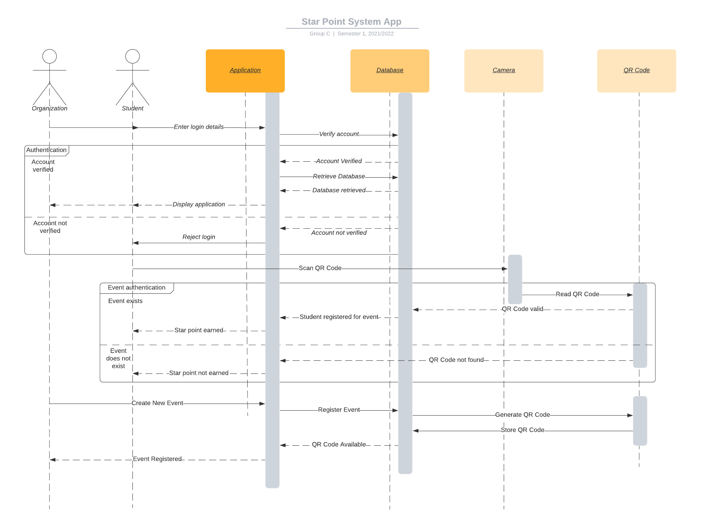

# Starpoint-system-app

## Group Members

| Name       | Matric Number    | 
| ------------- |-------------:| 
| Muhammad Hammizie bin Zamri    | 1812129 | 
| Muhammad Azri bin Hasin     | 1813785 |  
| Chairiandita Sheilla | 1810502 |  
| Muhammad Syahmi Aiman bin Mohd Shahrin | 1811893 | 

##  Title of the project. 
Starpoint System Application

##  Introduction
Star Point System App is an application that records star points by utilizing QR codes. The app will be benefited by both IIUM students and event organizers. 
The student only needs to scan the QR code provided by the event organizer, and star points will be awarded to their account. By using this app, the organizer 
will not need to make a spreadsheet that stores students’ details, causing a long queue at the entrance of the venue, which is a common occurrence in any event.

##  Objective
- To ease students in finding events to participate in and earn star points.
- To help students keep track of their star points after participating in events.
- To help event organizers promote their events to IIUM students.
- To help event organizers automate the process of awarding star points to participants.

## Features and Functionalities
- Email and password authentication (account management)
- Displays the latest events or programs in IIUM for students
- QR code scanning to join an event and earn star points
- Create programs or events and promote them on the homepage
- Get details of an event
- Keep track of star points earned
- Keep track of past programs that the users have joined

## Screen Navigation and Components

[https://www.figma.com/file/npaI38s7Wu8rlA6Z2zPyXD/Starpoint-System?node-id=0%3A1](https://www.figma.com/file/npaI38s7Wu8rlA6Z2zPyXD/Starpoint-System?node-id=0%3A1)

Link for app preview

[https://www.figma.com/proto/npaI38s7Wu8rlA6Z2zPyXD/Starpoint-System?node-id=7%3A214&scaling=scale-down&page-id=0%3A1&starting-point-node-id=7%3A214](https://www.figma.com/proto/npaI38s7Wu8rlA6Z2zPyXD/Starpoint-System?node-id=7%3A214&scaling=scale-down&page-id=0%3A1&starting-point-node-id=7%3A214)

## Sequence Diagram

